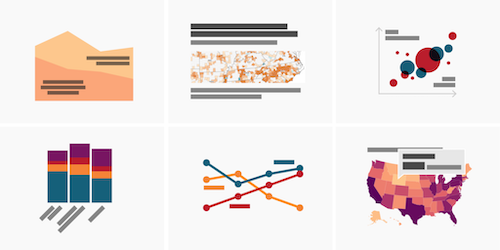
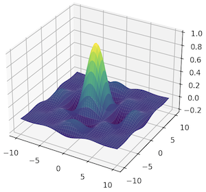
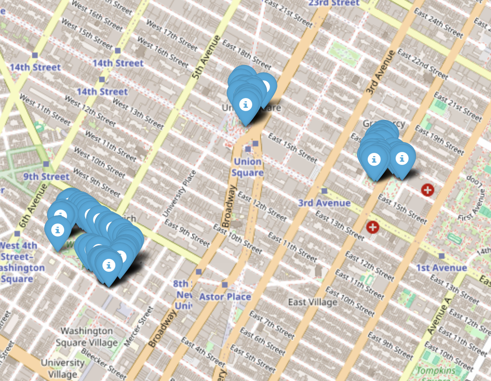
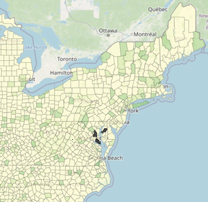
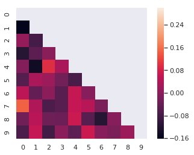

# Data Visualization using Python

(See this and more amazing visualizations at [datawrapper.de](https://blog.datawrapper.de/))

In this course you will learn to
* Find a dataset
* Ask an AI to write code to visualize that dataset
* Run that code on your computer
* Make changes to the visualization to better show what you want

## Start here!

Set up your [Windows](./windows) environment.

New to Python? See the [Python introduction](./pythonIntro) for a brief look at the language the AIs write code in.

## Using an AI to write code

You do not need to write any code. AIs have reached the level where they can write code for you. Take a look at an [example conversation](./examples) asking an AI to write code.

## Visualizations

### Numeric graphs

[Matplotlib](https://matplotlib.org/) makes graphs. It is very good for numeric data.

See the [matplotlib examples](./matplotlib) to learn about using Matplotlib.

### Coordinate points on a map

[Folium](https://python-visualization.github.io/folium/latest/#) makes it easy to put spatial data points onto a map. If you have a dataset with GPS coordinates for each record, Folium can put pins on the map for each record. For example, all sushi restaurants within 20 miles of RDU.

See the [Folium examples](./squirrels).

### Shade regions on a map

[GeoPandas](https://geopandas.org/en/stable/) makes it easy to plot spatially-aggregated data on a map. For instance, the number of public schools per county.

See the [GeoPandas examples](./publicLibraries).

### Identify missing data

Quite often some data is missing. [seaborn](https://seaborn.pydata.org/) can--among many, many other things--help visualize where data is missing.

See the [seaborn examples](./missing).

### Further exploration

There are many other data visualization modules. Here are some [popular modules](https://mode.com/blog/python-data-visualization-libraries).

## Datasets

There is a vast world of data out there. Available for free. To get started looking for datasets, try Googling for: `interesting data sets` or just ask an AI to help you find some.

Regional datasets
* [Durham OpenData](https://live-durhamnc.opendata.arcgis.com/)
* [data.gov (Durham, NC)](https://catalog.data.gov/dataset/?tags=durham&page=1)
* [NC State GIS datasets](https://www.lib.ncsu.edu/gis/datalist)

Various other datasets
* [Fun datasets](https://www.springboard.com/blog/data-science/15-fun-datasets-to-analyze/)
* [Beginner-friendly](https://www.kaggle.com/code/rtatman/fun-beginner-friendly-datasets)
* [Awesome public datasets](https://github.com/awesomedata/awesome-public-datasets)
* [NYC OpenData](https://opendata.cityofnewyork.us/)

## Scrubbing Data

Also called: cleaning or preprocessing. Datasets are great. They have wonderful information in them. But, they may also have some errors, blanks, or garbage. Before you can get a finished visualization of your data you may need to clean up the dataset. [Types of cleaning](https://www.tableau.com/learn/articles/what-is-data-cleaning) your data might need. If your data has gaps, it can be useful to [identifying missing values](https://github.com/ResidentMario/missingno).
