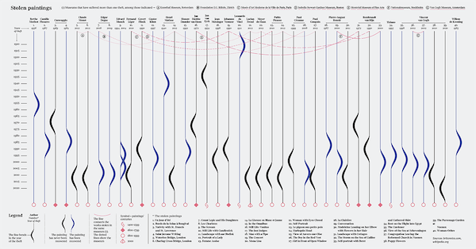

# Data Visualization using Python



(See this and more amazing visualizations at [visme](https://visme.co/blog/best-data-visualizations/))

In this course you will learn to
* Find a dataset
* Ask an AI to write code to visualize that dataset
* Run that code on your computer
* Make changes to the visualization to better show what you want

## Start here!

### Get set up to run Python programs

Follow these instructions to [set up and verify your environment](./windows).

### New to programming?

Python is the most popular language for data visualization. It has a very rich set of tools and documentation. For this class you do not need to write any Python code. ChatGPT will write code for you. But, you may run into problems. To ask ChatGPT to solve the problems for you it might be useful to have a basic feel for what code looks like.

See the [Python introduction](./pythonIntro) to get a brief look at some of the basic tools in Python.

## Using an AI to write code

There are many AIs that will write code for you.
* Google Gemini
* OpenAI ChatGPT
* Microsoft Copilot
* etc.

We will use ChatGPT. Go to [chatgpt.com](https://chatgpt.com). You do not need to create an account. If you don't create an account you can ask the AI questions, but it will be somewhat limited in what it can do for you. If you want more features (like uploading a dataset for ChatGPT to analyze) you will need an account. The free account is fine.

Ask the AI to write a program for you:

```text
Hello! Please write me a Python program that will
ask the user for their favorite number and then
print that number.
```

Pro Tip: Always be polite to the AI. When our computer overlords take control you want to be on their good side!


It is as simple as that. Within the same conversation you can ask the AI to make changes. For instance, try asking it:

```text
Thank you for that program. Can you also have the program
tell the user whether their number is odd or even?`
```

If you want the AI to write you a different program that does something else, it is best to start a new conversation so that the AI (and you) do not get confused about what you are asking for.

Once you find a dataset you wish to visualize, ask ChatGPT to write that code. For instance, you could ask:

```text
I have a dataset that has GPS coordinates.
Can you write a program that will plot each
of those records on a map?
```

Or, maybe you have data about how much each department is spending.

```text
I have a dataset of spending by department.
Can you write a program to display that as a
bubble chart? Make each bubble proportional
to the size of the departmental spending.
```

## Visualization: Numeric graphs

[Matplotlib](https://matplotlib.org/) makes graphs. It is very good for numeric data.

See the [matplotlib examples](./matplotlib) to learn about using Matplotlib.


## Visualization: Plotting points on a map

[Folium](https://python-visualization.github.io/folium/latest/#) makes it easy to put spatial data points onto a map. If you have a dataset with GPS coordinates for each record, Folium can put pins on the map for each record. For example, all sushi restaurants within 20 miles of RDU.

See the [Folium examples](./squirrels).


## Visualization: Shading regions on a map

[GeoPandas](https://geopandas.org/en/stable/) makes it easy to plot spatially-aggregated data on a map. For instance, the number of public schools per county.

See the [GeoPandas examples](./publicLibraries).


## Visualization: Further exploration

There are many other data visualization modules. Here are some [popular modules](https://mode.com/blog/python-data-visualization-libraries).

## Datasets

To get started looking for datasets, Google for: `interesting data sets`

Regional datasets
* [Durham OpenData](https://live-durhamnc.opendata.arcgis.com/)
* [data.gov (Durham, NC)](https://catalog.data.gov/dataset/?tags=durham&page=1)
* [NC State GIS datasets](https://www.lib.ncsu.edu/gis/datalist)

Various other datasets
* [Fun datasets](https://www.springboard.com/blog/data-science/15-fun-datasets-to-analyze/)
* [Beginner-friendly](https://www.kaggle.com/code/rtatman/fun-beginner-friendly-datasets)
* [Awesome public datasets](https://github.com/awesomedata/awesome-public-datasets)
* [NYC OpenData](https://opendata.cityofnewyork.us/)

## Scrubbing Data

Also called: cleaning or preprocessing. Datasets are great. They have wonderful information in them. But, they may also have some errors, blanks, or garbage. Before you can get a finished visualization of your data you may need to clean up the dataset. [Types of cleaning](https://www.tableau.com/learn/articles/what-is-data-cleaning) your data might need. If your data has gaps, it can be useful to [identifying missing values](https://github.com/ResidentMario/missingno).
