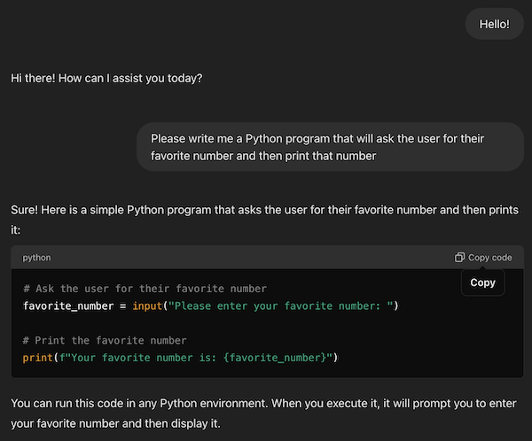

# Using an AI to write code

There are many AIs that will write code for you.
* Google Gemini
* OpenAI ChatGPT
* Microsoft Copilot
* etc.

We will use ChatGPT. Go to [chatgpt.com](https://chatgpt.com). You do not need to create an account. If you don't create an account you can ask the AI questions, but it will be somewhat limited in what it can do for you. If you want more features (like uploading a dataset for ChatGPT to analyze) you will need an account. The free account is fine.

## Our first AI-generated program

Ask the AI to write a program for you:

```text
Hello! Please write me a Python program that will
ask the user for their favorite number and then
print that number.
```

Pro Tip: Always be polite to the AI. When our computer overlords take control you want to be on their good side!



It is as simple as that. Within the same conversation you can ask the AI to make changes. For instance, try asking it:

```text
Thank you for that program. Can you also have the program
tell the user whether their number is odd or even?`
```

If you want the AI to write you a different program that does something else, it is best to start a new conversation so that the AI (and you) do not get confused about what you are asking for.

Once you find a dataset you wish to visualize, ask ChatGPT to write that code. For instance, you could ask:

```text
I have a dataset that has GPS coordinates.
Can you write a program that will plot each
of those records on a map?
```

Maybe you have data about how much each department is spending.

```text
I have a dataset of spending by department.
Can you write a program to display that as a
bubble chart? Make each bubble proportional
to the size of the departmental spending.
```
