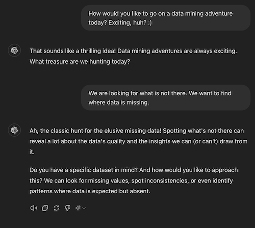
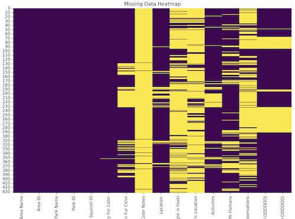

# Do we have all the data?



Quite often there will be data missing from a dataset. This is something to take into account when analyzing the data. For instance, if you are averaging the data you may want to remove any blank entries from the count (rather than them counting as zero). Or, perhaps you are plotting data on a map and want to gracefully skip records that do not have coordiantes.

You can ask an AI to write a program to visualize how much of your data is missing and where. You can also ask the AI to fill in missing data. In this example dataset we are missing the lat/lon coordinates of some of the squirrel sightings. But, we do know what park they were sighted in so we can ask the AI to make up reasonable lat/lon coordinates (rather than throwing away the sighting).

Continuing that conversation with the AI, let us ask it to analyze a portion of our data.

```text
I do have a specific dataset. Can I upload
the header and first few rows and you can suggest
what to explore from there?
```

It will look over the sample rows and suggest some things to analyze. We would like to look for missing data.

```text
Let's look for missing values. Can you write a program
that vill visually highlight missing data in my input file?
I would like to run it on my own file on my own computer.
My input file is named squirrel-data.csv.
```

Save the program it generates and run it. You should see a heatmap of your data with any gaps highlighted.



From here you can ask the AI to generate reasonable values for the missing data.

```text
It showed that the lat/lon coordinates are missing for
a lot of the entries. The data has an Area Name and a
Park Name for each record. Could you synthesize a lat/lon
to fill in if it is missing?
```

Save the program it generates and run it. Notice that it filled in some of the missing values, but not all of them. Can you figure out why it was not able to fill in all of them? How would you ask it to fill in the rest that are missing?
